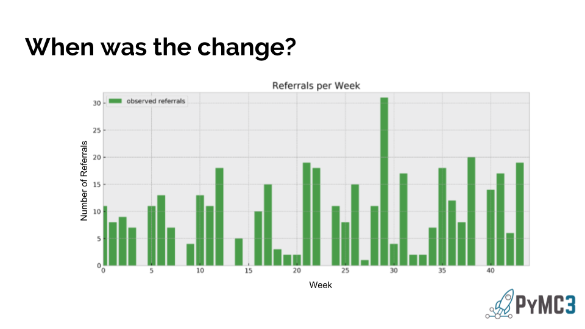
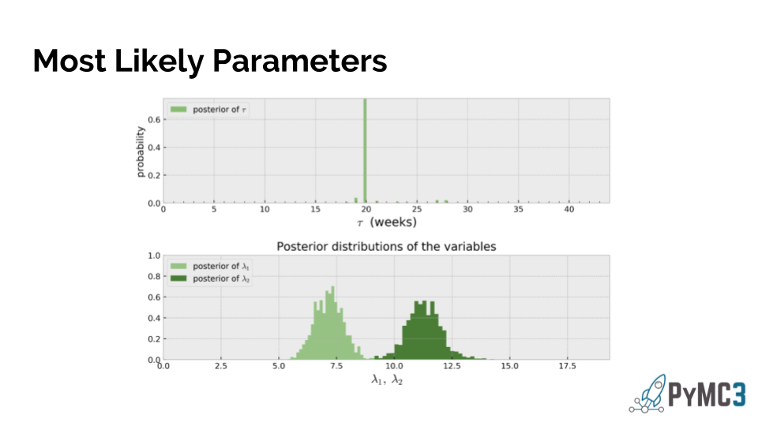
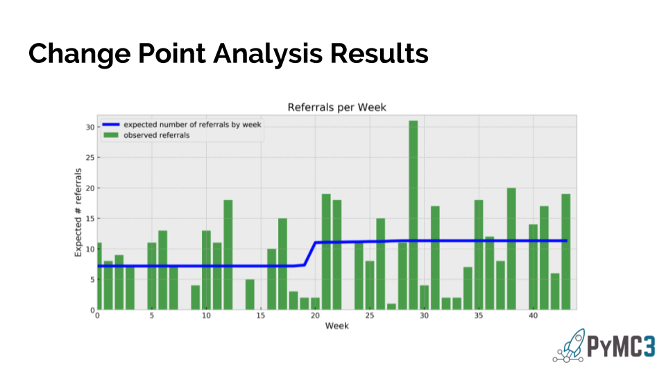

## Finding Changepoints in Physician Referral Patterns

*Utilization Management Medical Directors monitor physicians' referral patterns looking for a variety of anomalous behavior. A common example of the probabilistic programming package PyMC3 is identifying changepoints in rates as modeled by Poisson distributions. Here, that model is applied to idenify changepoints in referral rates for physicians in an effort to highlight likely changepoints to UM Medical Directors.*

This graph (below) shows a single doctor’s referrals by week over 45 weeks. Increases in referral rates could be a sign a doctor is becoming too reliant on other doctors in the network.  As you can see here, even when they have data, UM Medical directors find it hard to declare when and if a changepoint has occurred.

Below, PyMC3 allows us to define some unseen parameters that we don’t know the actual values for, make some initial conservative guesses at what they might be, and then allow the data to slowly update our guesses until we build some confidence for what the actual values are. We use tau to represent the week the change occurred, and two lambda parameters correspond to referral rates before and after the change. Bayes rule is used to compare many sets of values, tending to keep the values that are most likely given the data.

The result is a distribution of parameters that fit each doctor’s referral rates. In this particular case you can see a clear changepoint at week 20, and the referral rates before and after are well separated.

When we plot these values with the original data it looks this -   With a quantitative way to identify changepoints we can conduct a more objective, automatic search and improve our ability to manage utilization.

